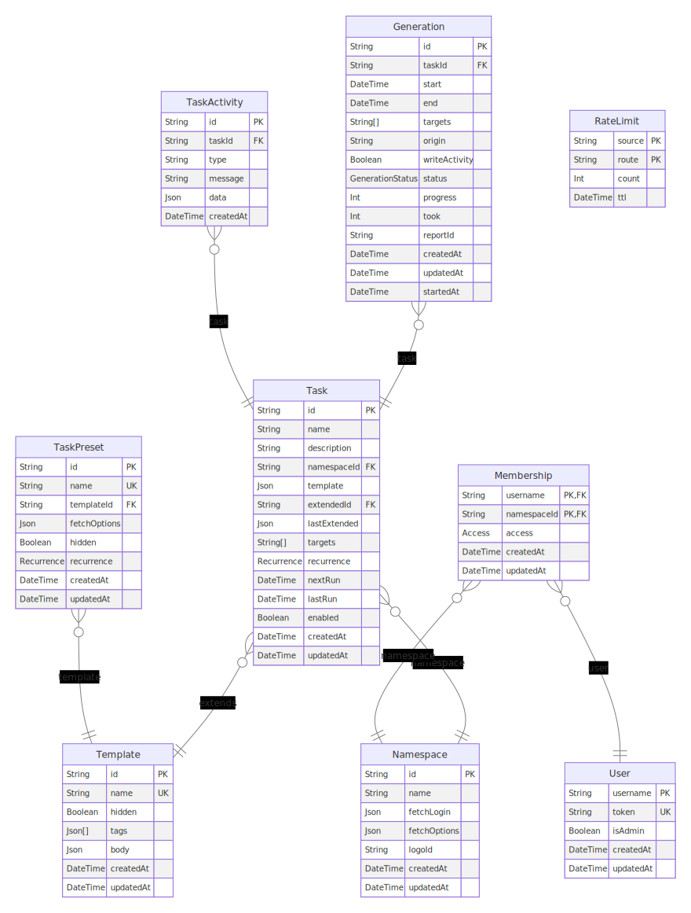

# Entity Relationship Diagram



## How to generate ?

```sh
curl -X POST -d "$(cat ./services/common/prisma/schema.prisma)" -H "Content-Type: text/plain" -o ./docs/ERD.svg https://p-erd.oxypomme.fr/erd/
```